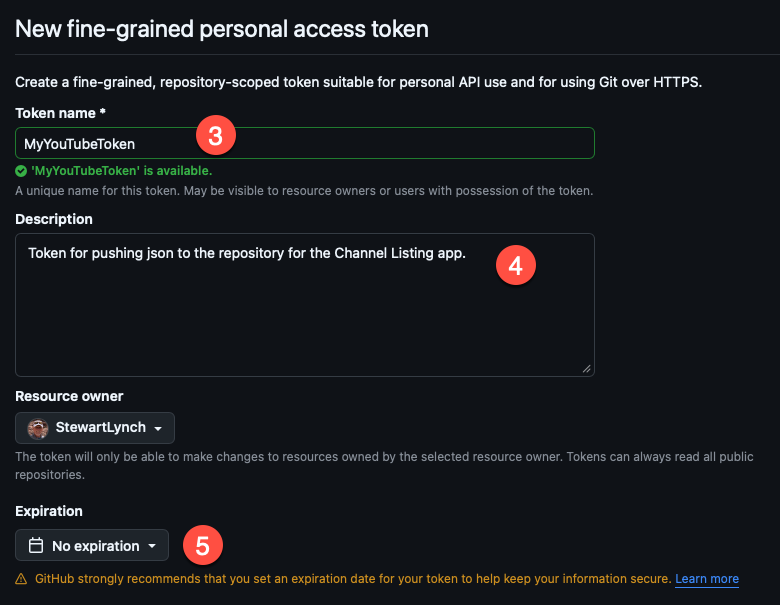
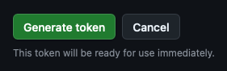
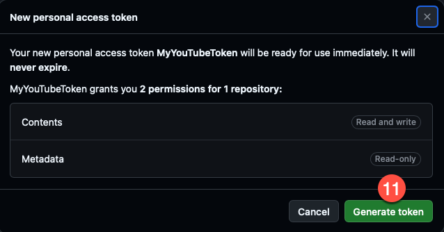
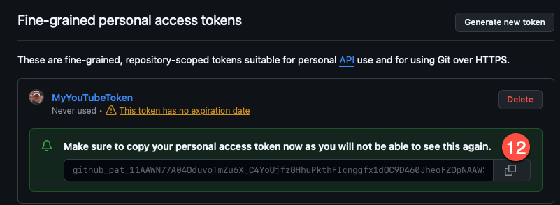
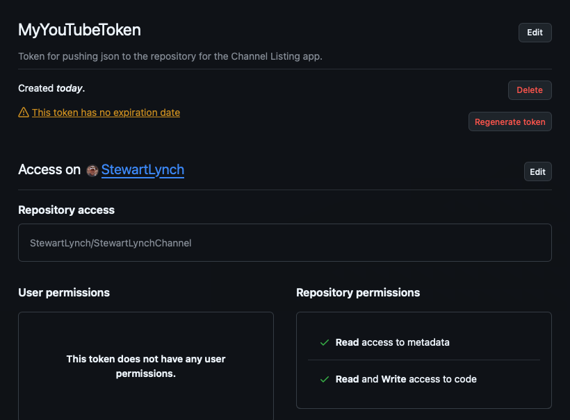
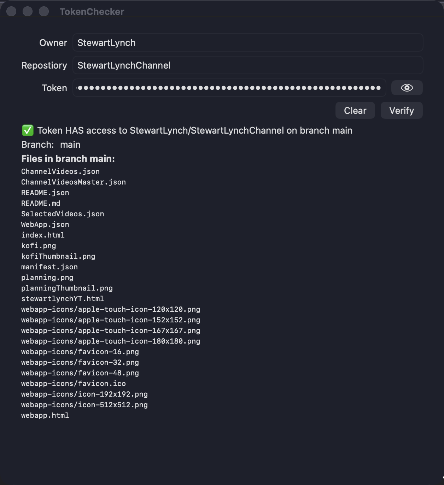

# Creating a GitHub Fine-grained Personal Access Token

> **NOTE:** you must be logged in to your GitHub account to create a personal access token

1. Once logged in to your GitHub account, go to **https://github.com/settings/personal-access-tokens** or
   1. Click on your profile picture in the top right
   2. Select “**Settings**” from the dropdown menu
   3. At the bottom the left navigation pane, select **Developer settings**
   4. Select **Personal access tokens** and then **Fine-grained tokens**

2. Click on **Generate new Token**
   1. You will have to authenticate with your GitHub account once more
3. Provide a Name for the token, though it is not used by the api, it is useful though and recommended as the name of the token if using my GitHub Pusher app.
4. Give it a description

#### Expiration

5. The default expiration is 30 days, but you can choose a longer expiration or one that never expires.

#### Repository Access

Here, you specify which repositories that you want the token to have access to.  This can be **Public repositories**, **All Repositories** or **Only selected repositories**

6. I recommend selecting **Only select repositories** and limit the vulnerability of the token to access all or more than the repositories that you want the token to have access to.

#### Permissions

Each repository selected for the token will be granted the same permissions.

7. Click on **+ Add Permissions**
8. **choose **Contents: Read and write**
9. The Metadata permissions is required and added by default

10. Click on **Generate token**

11. You will be asked to confirm that you want to generate the token so confirm that the information is correct and click on **Geenerate token**

12. Once it has been generated you need to copy the token and save it somewhere safe until you need to use it because you will not be able to see it again.

> **NOTE** At any time you can go back to this settings view and delete the token or regenerate the token and alter the expiration date. 

## Testing the token and access

You can use my TokenChecker app to test the validity of the token with respect to the owner and the specific repository

### Compiled App

You can download the zipped file from this repository (**TokenChecker.zip**)

### Source code

Or you can download the source code and build it yourself. **TokenChecker app folder**

This will verify that the repository is accessible and if so, will list all files initially in the default branch,

If there is more than one branch, you will be able to select another branch and see the files in that branch,

